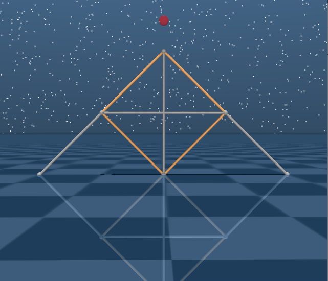
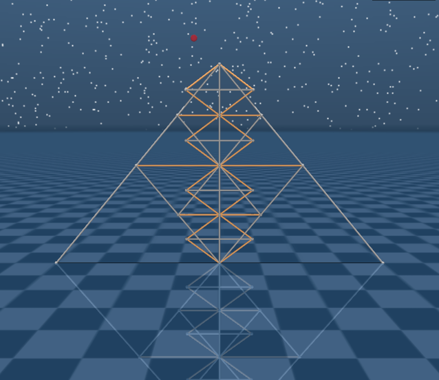
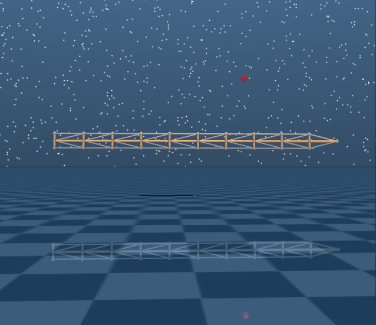
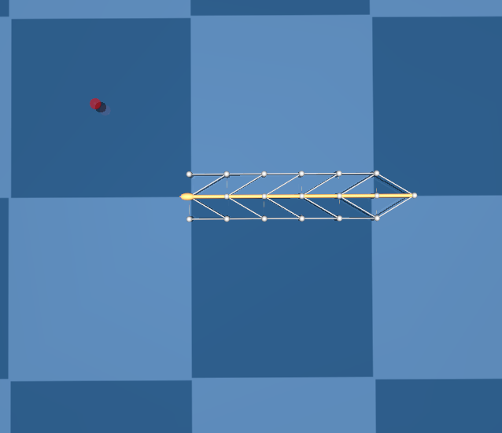
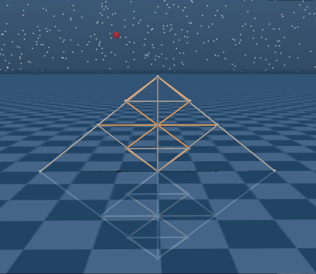

# d2c_mujoco200
d2c implementation on MuJoCo 200 windows x64 version

--------
D2C stands for Decoupled Data-based Control. It's a model-free optimal control algorithm proposed to solve finite-horizon control problems for stochastic discrete systems.

The algorithm has three steps:
1. Open-loop training using the first order gradient descent method
2. System identification along the nominal trajectory using the least square method
3. LQR feedback gain calculation for each discretized step
   
The code for each of the above steps is in a separate file.

The D2C algorithm has advantages in the following aspects over reinforcement learning(compared with DDPG)
1. Data efficiency
2. Reproducibility
   
D2C also has comparable performance with DDPG in robustness.

The D2C algorithm has advantages in the following aspects over the model-based method(compared with analytical shape control)
1. Robustness
2. Energy efficiency
3. Model-free

The details of the D2C algorithm can be found in <https://arxiv.org/abs/1904.08361>.

## File Structure

Tensegrity

- bin: the output dir for executable files. The .lib and .dll files are also here.
- data: the workspace for the examples. The models, training parameters and results are saved here. Also, to run the programs in the local folder, the MuJoCo key file, the .dll and .lib files should be put in the same folder here as the executable files. For example, in the folder data\Dbar\ .
  - cost0.txt: the 'nominal' cost values during training in thread 0.
  - converge.txt: gradient recorded for convergence checking.
  - dbar.xml: MuJoCo model file.
  - lnr.txt: the result of system identification in the form of [At : Bt].
  - parameters.txt: cost parameters and training parameters for the open-loop training step. The parameters should be in the order of diag(Q), diag(R), diag(QT), std of Gaussian perturbation and update stepsize.
  - result0.txt: the optimal control sequence from the open-loop training step.
  - TK.txt: the LQR feedback gains.
  - clopdata.txt: data used to compare the D2C open-loop policy and the D2C closed-loop policy by episodic cost.
  - perfcheck.txt: data used to check the terminal distance from the target with the D2C closed-loop policy applied.
  - energydata.txt: episodic energy data for the D2C closed-loop policy under different noise level. The energy is calculated as the L2-norm of the actuator control sequence.
  - *.dll: runtime library need for .exe files.
- doc: the backup MuJoCo key files, diary log file, Visual Studio setup guide(not translated yet), 3D tensegrity model generator and other files.
- hardware: code and documents for hardware work.
- include: the include dir for C++ projects. The MuJoCo header files, uitools lib, user lib(funclib.cpp, funclib.h) and other libraries are here.
- sample
  - Analytical_Control.m: model-based shape control code for tensegrity models(Dbar, T1D1, T2D1), generates force density and force on each string.
  - shape_control.m: main function for the model-based shape control.
  - mexstep.c: the Matlab wrapper. Use this file to call MuJoCo from Matlab.
  - tvlqr.m: LQR feedback gain calculation.
  - toplqr.m: top stabilizer gain calculation.
  - .cpp: source files for the d2c algorithm and result testing.
    - openloop.cpp: open-loop training code, generates optimal nominal control sequence.
    - sysid2dinv.cpp: system identification code for 2D models. The least-square is solved using matrix inversion method. The max step number and state number are subject to array size limitation.
    - sysid2dseq.cpp: system identification code for 2D models. The least-square is solved using iterative estimation method. The limitation for max step number and state number is less conservative.
    - test2d.cpp: testing code for 2D models. This file can visualize the simulation, compare the open-loop policy with closed-loop policy, calculate episodic energy and terminal distance from the target, show the model information.
    - dataprocess.py: python functions for data analysis and plotting.
  - openloop, sysid2d, test2d: Visual Studio projects.

## Set up

Operating system: Windows 64-bit

Software Platform: Visual Studio 2017, Matlab 2019a, Python 3

License Requirement: MuJoCo license from <https://www.roboti.us/license.html>.

For openloop, sysid2d and test2d, set up a Visual Studio project for each of them and generate the executable files.

For the Matlab wrapper, first set up the c compiler by running `mex setup` in Matlab. Then compile mexstep.c by `mex mexstep.c mujoco200.lib mujoco200nogl.lib`.

## Workflow

1. Write the MuJoCo model in the .xml file and put needed files in the workspace folder. Subfolders in `Tensegrity\data\` can be used as examples.
2. Write model-dependent parameters into funclib.cpp. Generate executable files: openloop.exe, sysid2d.exe and test2d.exe and put them into the workspace folder.
3. Open a command window in the workspace folder and run the D2C algorithm
   1. openloop: `openloop modelname.xml iteration_number [modeltype] [thread_number]` Modeltype is usually the same as modelname. If not, it needs to be specified for the code to identify the model.
   2. sysid2d: `sysid2d modelname.xml noise_level rollout_number [modeltype] [thread_number]` The standard deviation of perturbation is set as noise_level * Umax, where Umax is the maximum nominal control value from step 1.
   3. LQR gain: Run tvlqr.m in Matlab. Make sure the model dependent parameters align with those in funclib.cpp.
4. Test the result by running `test2d modelname.xml [modeltype] [mode] [noise_level]` in the command window. The options for mode are listed here:
   - modeltest: simulate the model with no control input and display. Some model parameters will be printed on the command window.
   - policy_compare: generate data for the D2C open-loop policy and closed-loop policy comparison under different noise level. Also outputs the episodic energy data for the D2C Closed-loop policy.
   - performance_test: generate data of the distance from the target with the D2C closed-loop and open-loop policy applied under different noise level.
   - nfinal: print the positions for all nodes. Copy-paste the sequence EXCEPT the last 3 values to shape_control.m to run analytical shape control.
5. Run the model-based shape control algorithm(shape_control.m) in Matlab. Make sure the Matlab wrapper is re-compiled or the .mexw64 file is in the workspace folder.
6. Make plots by the functions in dataprocess.py using the data generated from the above steps.

## Result

- Examples: 

## Acknowledgement

The tensegrity shape control code is from Raman Goyal.

The project is supervised by Dr. Suman Chakravorty.

Big big thanks to Muhao Chen and Raman Goyal for being so helpful and kind-hearted.